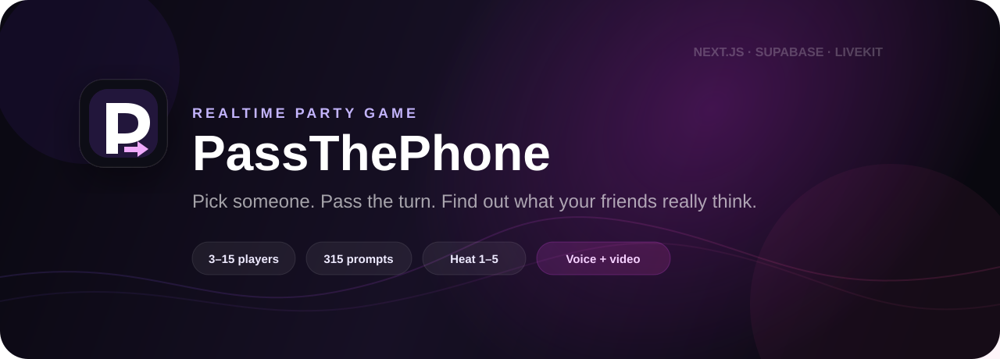
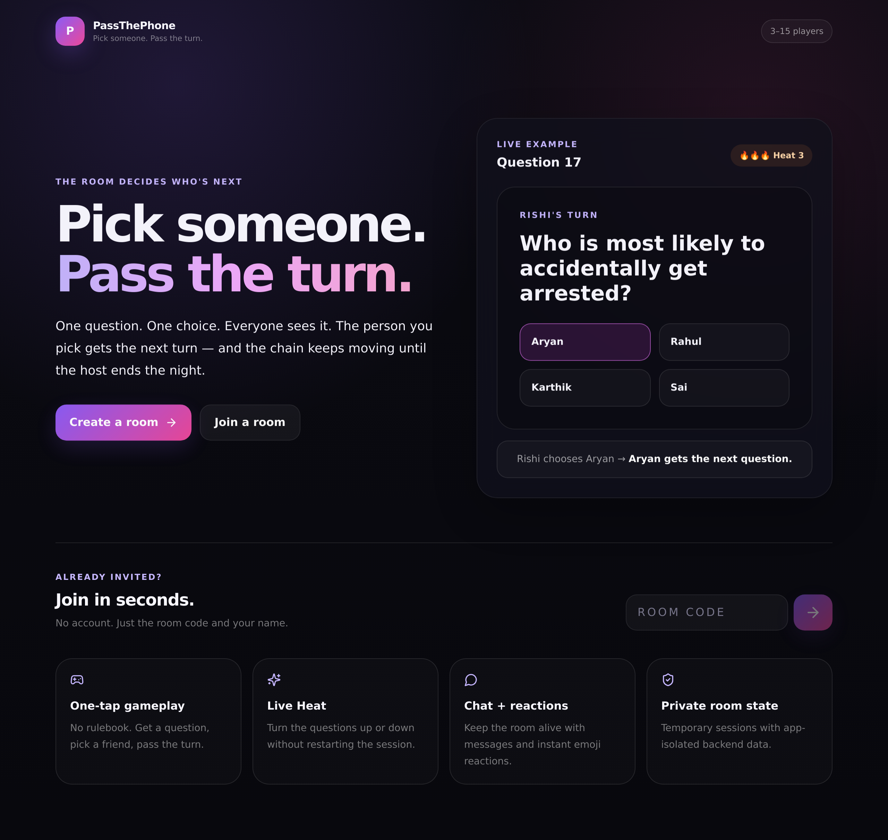
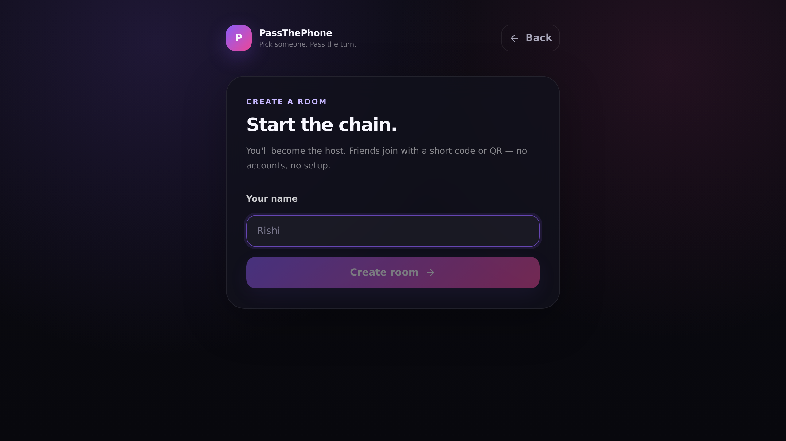
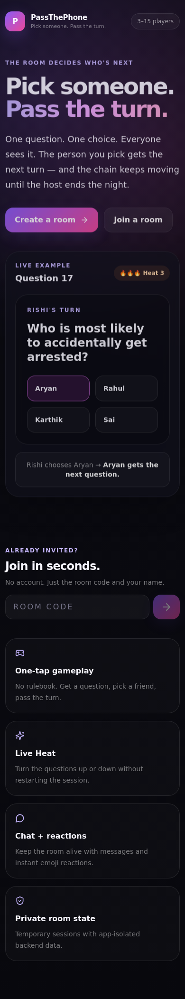
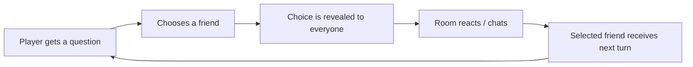
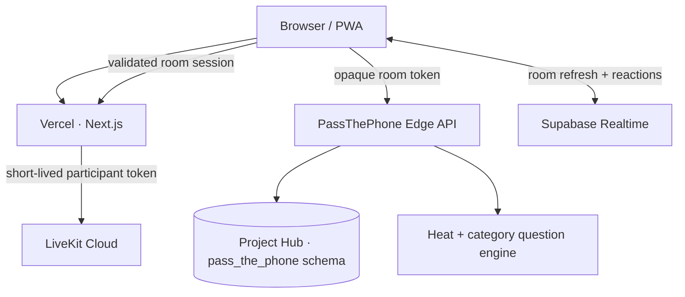

<p align="center">
  
</p>

<p align="center">
  <a href="https://passthephone-puce.vercel.app"></a>
  <a href="https://github.com/Rishikeshsanin/PassThePhone/actions/workflows/ci.yml"></a>
</p>

<p align="center">
  
  
  
  
  
  
  
</p>

<h3 align="center">Pick someone. Pass the turn. Find out what your friends really think.</h3>

<p align="center">
  A realtime multiplayer party game for <strong>3–15 friends</strong>. One player gets a “who would…” prompt, picks the person who fits best, everyone sees the choice, and the selected person gets the next turn.
</p>

<p align="center">
  <a href="https://passthephone-puce.vercel.app"><strong>Live app</strong></a>
  ·
  <a href="#screenshots"><strong>Screenshots</strong></a>
  ·
  <a href="#architecture"><strong>Architecture</strong></a>
  ·
  <a href="docs/TESTING.md"><strong>Testing</strong></a>
  ·
  <a href="CONTRIBUTING.md"><strong>Contributing</strong></a>
</p>

---

## Why PassThePhone is different

Most “most likely to” apps stop at anonymous voting.

PassThePhone turns the **selection itself into the game loop**:

```text
Rishi → Rahul → Aryan → Karthik → ...
```

Every answer is public. Every choice changes whose turn comes next. That creates the fun around the screen: arguments, inside jokes, reactions, chaos, and unexpectedly wholesome moments.

The app is intentionally simple to learn:

> **Read the question → pick a friend → everyone sees it → that friend gets the next turn.**

No account creation. No long onboarding. Just create a room and play.

## At a glance

| | |
| --- | --- |
| 👥 **Players** | 3–15 friends |
| 🎯 **Core loop** | Public A → B choice that passes the next turn |
| 🧠 **Prompt library** | 315 curated V1 questions |
| 🔥 **Heat** | 1–5, adjustable by the host even mid-game |
| 🎭 **Categories** | Classic, Funny, Wholesome, Personal, Dark, 18+, Fantasy, Popular |
| ⏱️ **Session modes** | 20 / 30 / 40 / Unlimited |
| 💬 **Social layer** | Realtime chat + floating reactions |
| 📞 **Remote play** | Optional LiveKit voice + video |
| 🏆 **Ending** | Awards, receipts, stats, replay |
| 📱 **Platform** | Responsive web app + installable PWA |

## Screenshots

### Desktop experience

<p align="center">
  
</p>

<p align="center">
  
</p>

### Mobile-first UI

<p align="center">
  
</p>

> Screenshots are captured automatically from the production site by a dedicated GitHub Actions workflow, so the repository visuals can stay in sync with the product.

## Features

### Realtime multiplayer

- 3–15 players per room
- short room codes
- QR joining
- refresh/reconnect recovery
- Supabase Realtime for low-latency updates
- polling fallback for resilience
- no permanent account system required

### Game engine

- 20, 30, 40, and Unlimited session lengths
- 315 curated questions
- no repeats inside the same session
- skipped prompts are also tracked to prevent repeats
- multi-category question pools
- category-aware Heat scoring
- anti-ping-pong turn balancing for bigger groups

### Live host controls

The host can change the room **while the game is running**:

- 🔥 increase/decrease Heat
- 🎭 change categories
- ⏭️ skip a question
- 🛑 end the game

Mid-game Heat changes are intentionally non-destructive:

- the question already on screen stays unchanged;
- the new Heat applies from the next question;
- round number is preserved;
- existing choices and chat remain intact.

### Social layer

- attributable public choice reveals
- live chat
- floating emoji reactions
- voice rooms
- video rooms
- receipt sharing
- data-driven final awards

### Product polish

- responsive desktop/mobile UI
- installable PWA
- reduced-motion support
- shareable visual receipt cards
- loading/error states
- room recovery after refresh
- production health checks
- real backend smoke testing

## How a round works



Example:

> **Who is most likely to get arrested for something completely stupid?**  
> Rahul picks **Aryan**.  
> Everyone sees **Rahul → Aryan**.  
> Aryan gets the next question.

That chain continues until the selected session length ends or the host ends an Unlimited room.

## Heat

Heat is not just an “offensive mode.” It changes intensity **inside the selected category**.

| Category | Lower Heat | Higher Heat |
| --- | --- | --- |
| Funny | playful | embarrassing / chaotic |
| Personal | casual | more revealing |
| Wholesome | light positivity | deeper friendship prompts |
| Dark | mild dark humor | bolder hypotheticals |
| 18+ | mature dating | stronger relationship questions, still non-explicit |
| Fantasy | light scenarios | higher-stakes fictional situations |

The host can move Heat from **1 → 5** or back down at any point in an active game.

## Architecture



### State ownership

The browser handles presentation, interaction state, reconnect persistence, realtime subscriptions, and media permissions.

The server owns authoritative multiplayer state:

- room membership;
- host authorization;
- configuration;
- Heat/category changes;
- turn progression;
- choices;
- chat writes;
- final results;
- replay transitions.

Read the deeper technical breakdown in **[docs/ARCHITECTURE.md](docs/ARCHITECTURE.md)**.

## Project Hub isolation

PassThePhone deliberately uses the existing shared Supabase **Project Hub** rather than consuming a dedicated project.

It is registered as **App #12** and restricted to:

```text
pass_the_phone.*
```

Primary tables:

```text
rooms
players
choices
chat_messages
```

The required safety preflight is:

```sql
select hub.assert_app_scope('pass_the_phone', 'pass_the_phone');
```

The runtime does not depend on another app's schema.

Before backend work, read:

- [AGENTS.md](AGENTS.md)
- [SUPABASE_HUB_RULES.md](SUPABASE_HUB_RULES.md)

## Security model

- no privileged database secret is shipped to the browser;
- room access uses random opaque player tokens;
- stored room credentials are hashed;
- RLS remains enabled as defense in depth;
- writes are restricted to the registered PassThePhone scope;
- LiveKit API secret stays server-side;
- LiveKit participant tokens are created only after validating an existing PassThePhone player session;
- the LiveKit health endpoint exposes only booleans, never credentials.

See **[SECURITY.md](SECURITY.md)** for the repository security policy.

## Tech stack

| Layer | Technology |
| --- | --- |
| Frontend | Next.js 15, React 19, TypeScript |
| Styling | Tailwind CSS |
| Multiplayer state | Supabase Postgres |
| Realtime | Supabase Realtime |
| Server operations | Supabase Edge Functions |
| Voice/video | LiveKit |
| Hosting | Vercel |
| PWA | Web App Manifest + Service Worker |
| CI | GitHub Actions |
| Verification | Typecheck + production build + real multiplayer smoke test |

## Local development

### 1. Clone

```bash
git clone https://github.com/Rishikeshsanin/PassThePhone.git
cd PassThePhone
```

### 2. Install

```bash
npm install
```

### 3. Run

```bash
npm run dev
```

Open:

```text
http://localhost:3000
```

### Environment variables

Browser-safe Supabase values can be overridden with:

```env
NEXT_PUBLIC_SUPABASE_URL=...
NEXT_PUBLIC_SUPABASE_PUBLISHABLE_KEY=...
```

Optional voice/video requires server-side LiveKit values:

```env
LIVEKIT_URL=wss://your-project.livekit.cloud
LIVEKIT_API_KEY=...
LIVEKIT_API_SECRET=...
```

Never expose `LIVEKIT_API_SECRET` with a `NEXT_PUBLIC_` prefix.

For production details, see **[docs/DEPLOYMENT.md](docs/DEPLOYMENT.md)**.

## Verification

CI protects the core product path with:

```bash
npm run typecheck
npm run build
node scripts/api-smoke.mjs
```

The smoke test uses a temporary isolated room and checks:

```text
create
  → join multiple players
  → configure
  → start
  → raise Heat mid-game
  → prove current question/state is preserved
  → choose
  → next turn
  → lower Heat
  → chat
  → end
  → awards
  → replay
```

Full testing notes: **[docs/TESTING.md](docs/TESTING.md)**.

## Repository structure

```text
PassThePhone/
├── .github/
│   ├── ISSUE_TEMPLATE/
│   ├── pull_request_template.md
│   └── workflows/
├── docs/
│   ├── screenshots/
│   ├── ARCHITECTURE.md
│   ├── DEPLOYMENT.md
│   └── TESTING.md
├── public/
├── scripts/
│   └── api-smoke.mjs
├── src/
│   ├── app/
│   ├── components/
│   ├── data/
│   ├── lib/
│   └── types/
├── supabase/
│   ├── functions/
│   └── migrations/
├── CHANGELOG.md
├── CONTRIBUTING.md
├── SECURITY.md
└── SUPABASE_HUB_RULES.md
```

## Engineering choices

A few deliberate decisions make the project more than a static party-game demo:

**Server-authoritative room state.**  
The client requests actions; the backend validates room identity, host/player permissions, and the next legal state.

**Realtime + fallback.**  
Realtime improves responsiveness, while polling keeps the experience recoverable if websocket events are missed.

**Scoped shared infrastructure.**  
The app demonstrates how multiple products can safely share one Supabase project without sharing application tables.

**Gameplay regression tests.**  
CI does not stop at compilation. It creates a real multiplayer room and verifies the core state machine against the deployed backend.

**Voice/video separated from game correctness.**  
LiveKit is an optional communication layer, not a dependency for the game loop.

## Roadmap

- [x] Realtime 3–15 player rooms
- [x] QR + code joining
- [x] 20 / 30 / 40 / Unlimited sessions
- [x] 315 curated prompts
- [x] Multi-category selection
- [x] Heat 1–5
- [x] Mid-game Heat/category controls
- [x] Chat + reactions
- [x] Awards + receipts
- [x] Replay + reconnect recovery
- [x] Voice/video rooms
- [x] PWA install flow
- [x] Shareable visual receipts
- [x] CI + real multiplayer smoke test
- [x] Production screenshots in repo
- [ ] Continue expanding the curated question catalogue from real play feedback

## Project documentation

- **[Architecture](docs/ARCHITECTURE.md)** — system boundaries, realtime model, LiveKit flow
- **[Testing](docs/TESTING.md)** — CI coverage + manual release checklist
- **[Deployment](docs/DEPLOYMENT.md)** — Vercel, Supabase, LiveKit production setup
- **[Project Hub rules](SUPABASE_HUB_RULES.md)** — strict shared-database boundary
- **[Contributing](CONTRIBUTING.md)** — local workflow and PR expectations
- **[Security](SECURITY.md)** — security model and reporting guidance
- **[Changelog](CHANGELOG.md)** — notable product changes

---

<p align="center">
  <strong>Built as a real consumer multiplayer product, not a static portfolio demo.</strong>
</p>

<p align="center">
  <a href="https://passthephone-puce.vercel.app">Play PassThePhone</a>
  ·
  <a href="https://github.com/Rishikeshsanin/PassThePhone/issues">Report a bug</a>
  ·
  <a href="https://github.com/Rishikeshsanin/PassThePhone/issues/new?template=feature_request.yml">Suggest a feature</a>
</p>
