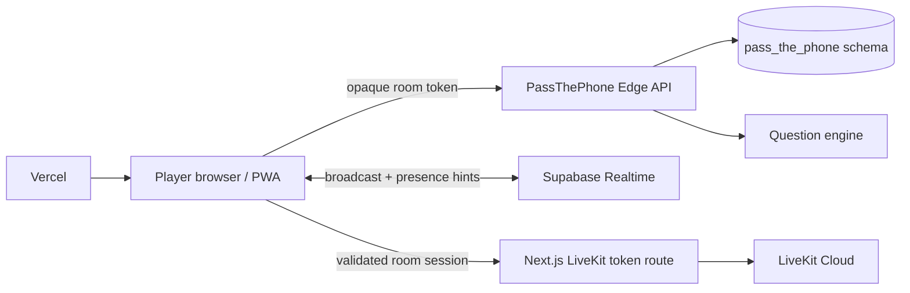

# Architecture

PassThePhone is designed as a lightweight client with a server-authoritative multiplayer state layer.

## System overview

## Runtime responsibilities

### Browser

The browser owns:

- UI and local interaction state;
- room token persistence for refresh recovery;
- realtime subscriptions / polling fallback;
- microphone and camera permission UX;
- visual receipts and share flow.

The browser does **not** own authoritative multiplayer decisions.

### PassThePhone Edge API

The Edge API owns:

- room creation and joining;
- host authorization;
- room configuration;
- game start / skip / end;
- public choices;
- turn progression;
- Heat and category changes;
- chat writes;
- final result generation;
- replay-safe state transitions.

### Postgres / Project Hub

Application data lives in the isolated `pass_the_phone` schema.

Primary tables:

| Table | Purpose |
| --- | --- |
| `rooms` | authoritative session configuration and current game state |
| `players` | room membership, host flag, session credential hash |
| `choices` | attributable A → B question selections |
| `chat_messages` | room-scoped chat |

RLS remains enabled as defense in depth.

### Question engine

The prompt catalogue ships with the application. Selection is:

- category-aware;
- Heat-aware;
- no-repeat inside the same session;
- skip-aware;
- constrained by the remaining prompt pool.

### LiveKit

Voice/video is optional and isolated from game state.

The server:

1. validates the PassThePhone room code + room token;
2. confirms the player exists in that room;
3. mints a short-lived LiveKit participant token;
4. never exposes the LiveKit API secret to the browser.

## Multiplayer resilience

The UI uses Realtime for low-latency room refreshes and reactions, while polling acts as a fallback if realtime delivery is delayed or unavailable.

This keeps game state recoverable after refresh and avoids making correctness depend on one websocket event.

## Heat semantics

Heat changes are server-authorized host configuration changes.

A Heat update:

- does **not** replace the question already on screen;
- does **not** reset round number;
- does **not** erase previous choices or chat;
- affects question selection beginning with the next prompt.

That behavior is covered by the API smoke test.

## Trust boundary

The important boundary is:

> browser requests intent; server validates identity + host/player permissions; server mutates only the registered PassThePhone scope.

For backend changes, read [SUPABASE_HUB_RULES.md](../SUPABASE_HUB_RULES.md).
